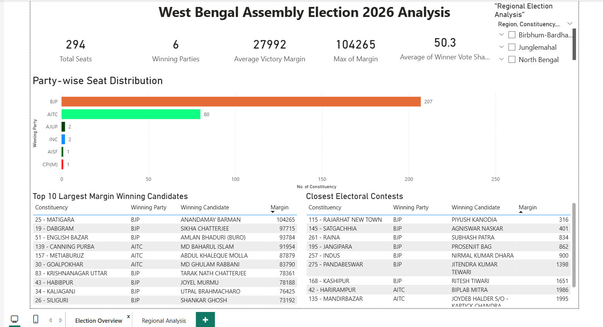
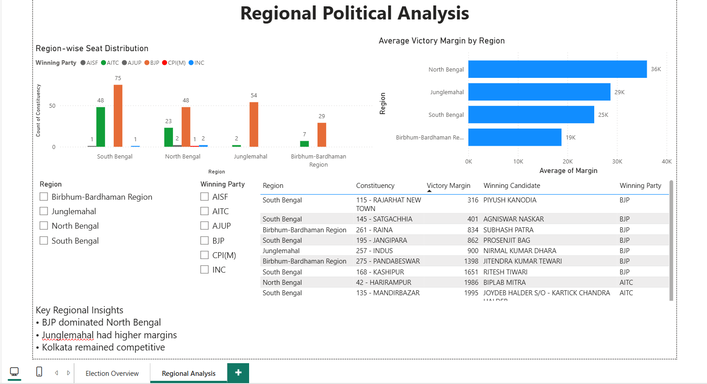
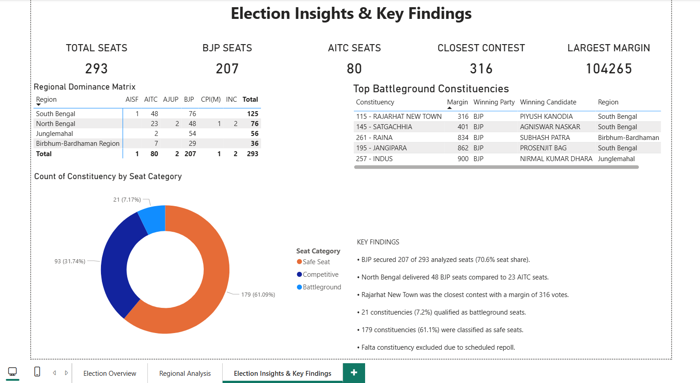

# West Bengal Assembly Election 2026 – Political Analytics Dashboard

## Overview

This project presents a comprehensive political analytics dashboard built using Power BI to analyze the West Bengal Assembly Election 2026 results.

The dashboard transforms raw constituency-level election data into actionable insights through seat distribution analysis, regional political trends, victory margin analysis, battleground constituency identification, and executive-level election intelligence.

---

## Objectives

- Analyze party-wise seat performance across West Bengal.
- Identify regional political dominance patterns.
- Measure electoral competitiveness using victory margins.
- Detect battleground constituencies and safe seats.
- Generate data-driven political insights for decision-making.

---

## Tools & Technologies

- Power BI
- Microsoft Excel
- DAX (Data Analysis Expressions)
- Election Commission of India (ECI) Election Data

---

## Data Preparation

### Data Cleaning
- Removed unnecessary fields.
- Standardized constituency names.
- Verified winning candidate and runner-up records.
- Calculated victory margins.
- Categorized constituencies into regions:
  - North Bengal
  - South Bengal
  - Junglemahal
  - Birbhum–Bardhaman Region

### Feature Engineering
Created analytical fields including:

- Winning Candidate
- Winning Party
- Runner-Up Candidate
- Runner-Up Party
- Victory Margin
- Winner Vote Share
- Region Classification
- Seat Competitiveness Category

---

# Dashboard Structure

## Page 1 – Election Overview

Provides a high-level summary of election outcomes.

### Key Features

- Total Seats Analyzed
- Party-wise Seat Distribution
- Average Victory Margin
- Maximum Victory Margin
- Closest Electoral Contest
- Top 10 Largest Victory Margins
- Top 10 Closest Electoral Contests

### Screenshot



---

## Page 2 – Regional Analysis

Examines electoral outcomes across major regions of West Bengal.

### Key Features

- Region-wise Seat Distribution
- Party Performance by Region
- Average Victory Margin by Region
- Regional Filters and Slicers
- Region-specific Electoral Insights

### Screenshot



---

## Page 3 – Election Insights & Key Findings

Executive-level summary highlighting major election trends.

### Key Features

- Total Seats
- BJP Seats
- AITC Seats
- Closest Contest
- Largest Margin
- Regional Dominance Matrix
- Top Battleground Constituencies
- Constituency Competitiveness Classification
- Strategic Election Findings

### Screenshot



---

# Constituency Competitiveness Classification

Constituencies were classified based on victory margins:

| Margin | Category |
|----------|----------|
| Less than 5,000 votes | Battleground |
| 5,000 – 20,000 votes | Competitive |
| More than 20,000 votes | Safe Seat |

---

# Key Findings

- BJP secured **207 of 293 analyzed seats (70.6% seat share)**.
- North Bengal emerged as BJP's strongest region with **48 seats**, compared to **23 seats for AITC**.
- Rajarhat New Town recorded the closest electoral contest with a margin of **316 votes**.
- **21 constituencies (7.2%)** qualified as battleground seats.
- **93 constituencies (31.7%)** were classified as competitive seats.
- **179 constituencies (61.1%)** were classified as safe seats.
- Competitive and battleground seats together accounted for **38.9%** of all analyzed constituencies.

---

# Business / Political Value

This dashboard demonstrates how election data can be transformed into strategic intelligence through:

- Electoral trend analysis
- Regional dominance assessment
- Competitiveness tracking
- Political decision support
- Data-driven storytelling

---

# Project Files

```text
├── WB_Election_2026_Political_Analytics_Dashboard.pbix
├── Election_Data.xlsx
├── README.md
└── images
    ├── page1_overview.png
    ├── page2_regional_analysis.png
    └── page3_key_findings.png
```

---

# Data Source

Election Commission of India (ECI)

Note:
Falta Assembly Constituency was excluded from the analysis due to the scheduled repoll conducted on 21 May 2026.

---

## Author

**Saharsh Deshmukh**

Aspiring Data Analyst | Power BI | Excel | SQL | Political Analytics

LinkedIn: [Add Your LinkedIn Profile]
GitHub: [Add Your GitHub Profile]
